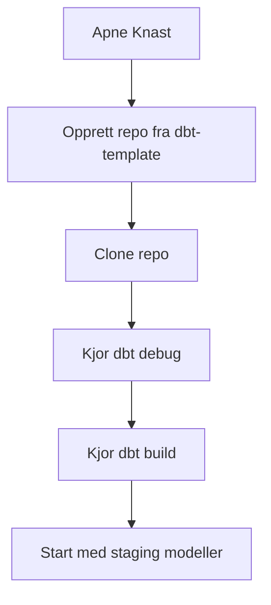
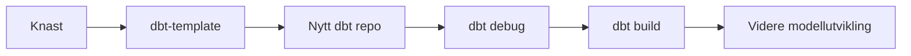

# Komme i gang med dbt i DVH

Denne siden er en kort oversikt over hva du trenger for å komme i gang med dbt i DVH.

Hovedpoenget er enkelt: veien videre er Knast. Oppsett for VDI er deprecated, på vei ut, og ligger kun igjen som arkiv for eldre behov.

## Kortversjonen

Hvis du kan gjøre dette, er du i gang.

## Dette trenger du

For å være operativ i DVH med dbt trenger du i praksis bare dette:

- tilgang til Knast
- tilgang til GitHub-repoet ditt
- et nytt repo opprettet fra [navikt/dbt-template](https://github.com/navikt/dbt-template)
- nødvendige databasetilganger for teamet ditt

Du trenger normalt ikke:

- lokal installasjon av Python
- manuell installasjon av dbt
- manuell installasjon av Oracle-drivere
- nytt VDI-oppsett

## Anbefalt vei inn

## Start her

Hvis du er ny, anbefales denne rekkefølgen:

1. Les [Opprett nytt dbt-prosjekt](opprett-prosjekt.md)
2. Les [Håndtering av hemmeligheter i Knast](../dbt%20i%20Knast/handtering-av-hemmeligheter.md)
3. Les [Utvikling av dbt-prosjekter i Knast](../dbt%20i%20Knast/utvikling-av-dbt-prosjekter.md)
4. Kjør første `dbt debug`
5. Kjør første `dbt build`

Dette er den raskeste veien til å komme i gang uten å gå seg bort i gammel dokumentasjon.

## Hva Knast skal gi deg

Knast er standard utviklingsmiljø for dbt i DVH. Det betyr at miljøet allerede skal være rigget for at du kan utvikle og kjøre dbt-prosjekter uten manuell maskinoppsett.

Typisk betyr det at du har:

- Git
- editor og terminal
- dbt med Oracle-adapter
- Oracle-klient og nødvendige biblioteker
- tilgang til relevante databaser og verktøy

Hvis du må bruke tid på å installere grunnleggende verktøy selv, er noe feil i oppstartsløpet.

## Hva som er første milepæl

Du er oppe å gå når du kan:

- åpne repoet i Knast
- lese og endre en modell
- kjøre `dbt debug`
- kjøre `dbt run` eller `dbt build`
- få et grønt resultat eller en konkret dbt-feil du kan jobbe videre med

## Hva du ikke bør bruke tid på

Ikke start med dette:

- VDI-oppsett
- lokal miljøkonfigurasjon
- gammel installasjonsdokumentasjon
- avansert dbt-konfigurasjon før første vellykkede kjøring

Målet er først å få en fungerende grunnflyt i Knast.

## VDI er arkivstoff

Oppsett for VDI er deprecated og på vei ut. Dokumentasjonen finnes fortsatt i arkivet for historikk og overgangsbehov, men er ikke anbefalt startpunkt for nye brukere eller nye prosjekter.

Hvis du starter nytt arbeid i dag, skal du tenke:

- Knast for utvikling
- `dbt-template` for prosjektopprettelse
- GitHub for kode og samarbeid

## Neste sider å lese

- [Opprett nytt dbt-prosjekt](opprett-prosjekt.md)
- [Håndtering av hemmeligheter i Knast](../dbt%20i%20Knast/handtering-av-hemmeligheter.md)
- [Utvikling av dbt-prosjekter i Knast](../dbt%20i%20Knast/utvikling-av-dbt-prosjekter.md)