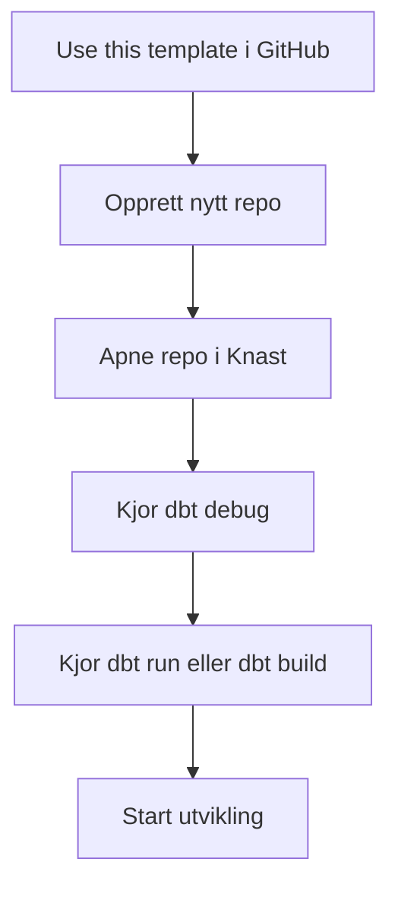
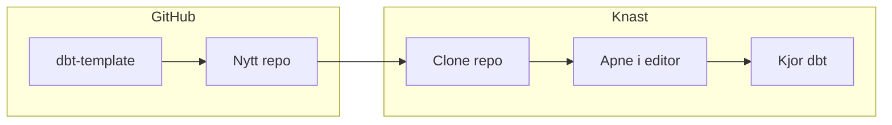
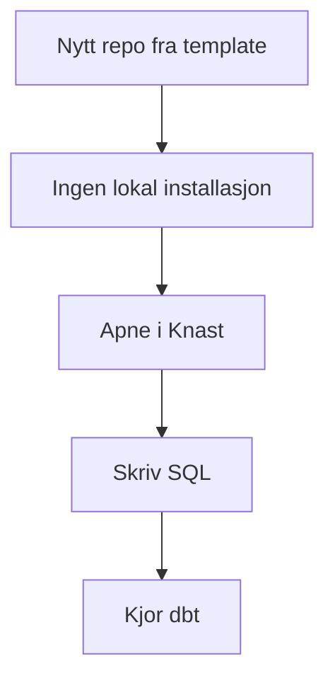

# Opprett nytt dbt-prosjekt

Denne siden beskriver anbefalt oppstart for nye dbt-prosjekter i NAV, med utgangspunkt i at vi bruker [navikt/dbt-template](https://github.com/navikt/dbt-template) som mal og at denne fungerer som et ettklikksoppsett.

Målet er enkelt: du skal kunne opprette et nytt repo, åpne det i Knast og kjøre dbt uten å bruke tid på lokal miljøkonfigurasjon.

## Kortversjonen



Hvis dette fungerer, er du i gang.

## Hvorfor bruke dbt-template?

`dbt-template` skal være standard startpunkt for nye dbt-prosjekter i NAV. Tanken er at et nytt prosjekt ikke skal begynne med manuell oppsettjobb, men med en ferdig mal som allerede har det viktigste på plass.

Med et ettklikksoppsett antar vi at templaten gir deg:

- grunnstruktur for et dbt-prosjekt
- ferdig `dbt_project.yml`
- eksempel på modellstruktur og dokumentasjon
- nødvendige filer for å komme raskt i gang i NAV-kontekst
- et oppsett som fungerer i Knast uten ekstra installasjon av Python, dbt eller drivere

## Hva Knast allerede gir deg

I NAV er Knast standard utviklingsmiljø for denne typen arbeid. I praksis betyr det at du allerede har tilgang til det du trenger for å begynne å utvikle.

Knast har normalt allerede:

- Git
- dbt med Oracle-adapter
- Oracle-klient og `oracledb`
- tilgang til nødvendige databaser og utviklingsverktøy

Det betyr at du ikke trenger å bruke tid på å installere Python, dbt eller Oracle-drivere lokalt før du kan starte.

## Slik ser oppstarten ut



## Opprett prosjektet i GitHub

1. Gå til [navikt/dbt-template](https://github.com/navikt/dbt-template)
2. Klikk `Use this template`
3. Opprett et nytt repository basert på templaten
4. Gi repoet et tydelig navn, for eksempel `<team>-dbt`

Velg et navn som gjør det enkelt å forstå hvilket team eller hvilken komponent repoet tilhører.

## Åpne prosjektet i Knast

Når repoet er opprettet:

1. Clone repoet i Knast
2. Åpne prosjektmappen i editoren
3. Bekreft at du ser et vanlig dbt-prosjekt med blant annet `dbt_project.yml`

På dette tidspunktet bør du normalt kunne begynne å jobbe direkte i prosjektet uten ekstra lokal oppsettjobb.

## Første kommandoer du bør kjøre

Kjør disse kommandoene først:

```shell
dbt debug
dbt run
```

Hvis prosjektet har modeller og avhengigheter satt opp, kan det også være naturlig å kjøre:

```shell
dbt build
```

## Hva disse kommandoene forteller deg

### `dbt debug`

Brukes for å verifisere at miljøet fungerer:

- at dbt er tilgjengelig
- at profil og tilkobling fungerer
- at prosjektet kan leses riktig

Hvis `dbt debug` feiler, er det som regel feil sted å begynne å skrive modeller. Få først miljø, profiler og tilkobling på plass.

### `dbt run`

Brukes for å verifisere at prosjektet faktisk kan bygge modeller i databasen.

Hvis `dbt run` går grønt, vet du at templaten og miljøet fungerer godt nok til å starte utvikling.

## Hva du bør ha etter fem minutter

Et nytt prosjekt er godt nok satt opp når du kan gjøre dette:

- åpne repoet i Knast
- lese og endre SQL i prosjektet
- kjøre `dbt debug`
- kjøre `dbt run` eller `dbt build`
- begynne å lage eller endre modeller

Det er den viktigste testen på at oppsettet faktisk er et ettklikksoppsett og ikke bare en mal som krever manuell etterarbeid.

## Anbefalt start i et nytt prosjekt

Når prosjektet er oppe, anbefales denne rekkefølgen:

1. Les `dbt_project.yml`
2. Finn hvor modellene ligger
3. Kjør `dbt debug`
4. Kjør `dbt run` eller `dbt build`
5. Lag en liten første endring i en modell
6. Kjør på nytt og bekreft at endringen virker

Ikke begynn med avansert konfigurasjon før du har bekreftet at grunnflyten fungerer.

## Hva templaten ideelt sett bør inneholde

Siden denne dokumentasjonen tar utgangspunkt i at `dbt-template` skal oppdateres som en moderne startmal, bør den ideelt sett inneholde:

- et fungerende eksempelprosjekt
- enkel og tydelig modellstruktur
- eksempel på `source()` og `ref()`
- eksempel på grunnleggende tester
- tydelige steder der teamet skal fylle inn egne navn og koblinger
- minst mulig manuell oppstartskonfigurasjon

Jo mindre et team må endre før første vellykkede `dbt run`, desto bedre fungerer templaten som startpunkt.

## Viktig prinsipp

Grunnideen er denne:



Du skal kunne:

- opprette et nytt repo
- åpne det i Knast
- skrive SQL
- kjøre dbt

uten å konfigurere utviklingsmiljøet lokalt først.

## Når du bør stoppe og fikse oppsettet

Ikke gå videre med modellutvikling hvis noe av dette ikke fungerer:

- `dbt debug` feiler
- prosjektet mangler grunnleggende dbt-filer
- du får ikke kjørt modeller mot databasen
- templaten krever mye manuell konfigurasjon før første kjøring

Hvis dette skjer, er problemet som regel ikke i modellen din, men i prosjektmalen eller miljøet.

## Veien videre

Når prosjektet er opprettet og første kjøring fungerer, er neste naturlige steg å:

1. opprette eller koble til kilder
2. lage første staging-modell
3. legge på enkle tester
4. bygge videre mot intermediate- og mart-modeller