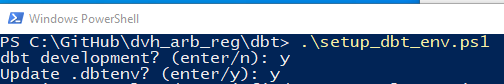

# Visual Studio Code

Bruk https://code.visualstudio.com/download, velg Windows versjonen. Last ned, pakk ut og start programmet code. Følg instruksjonene ved innstalleringen.

## Anbefalte extensions

### dbt Power User

dbt Power User gir oss en rekke nyttige verktøy, som f.eks.:

- lekker lineage vist i VS Code 
- Auto-complete dbt code
- SQL validator
- Preview query results
- en rekke snarveier, blant annet via egne knapper
- visning av generert SQL-kode (slipper å lete den frem i target-mappen)

[dbt Power User på GitHub](https://github.com/AltimateAI/vscode-dbt-power-user)

#### Installasjon og oppsett
Installeres via VS Code Marketplace, følg installasjonsrutinene til [Altimate](https://docs.myaltimate.com/)

##### Utover standardinstallasjon må følgende hensyn tas for bruk på VDI Utvikler og mot Oracle DVH:

dbt Power User krever at man setter opp **miljøvariabler** med credentials via PowerShell, **før** VS Code startes opp i samme PowerShell-sesjon.

Eksempel på hvordan man kan sette opp miljøvariabler i forkant via PowerShell:

1. lukk eventuelle eksisterende sesjoner av VS Code
2. start PowerShell i dbt-mappen i aktuelt dbt-prosjekt. Trykk på dbt-mappen, hold deretter inne Shift-tasten og høyreklikk på mappen. Velg `Åpne PowerShell-vindu her` (eller tilsvarende tekst på engelsk om du er litt mer internasjonal)

    

3. kjør `.\setup_dbt_env.ps1` + enter i PowerShell-vinduet som åpnet seg (skriv setup + trykk på TAB for auto-complete)

    

4. start VS Code fra samme PowerShell-vindu som `.\setup_dbt_env.ps1` ble kjørt i, `code .` + enter

    

(Espen jobber med et PowerShell script som skal gjøre denne operasjonen enklere)

**Preview query**-template må endres til: `select * from ({query})\n where ROWNUM <= {limit}`, ref. [#dbtquerytemplate-for-oracle](https://docs.myaltimate.com/setup/optConfig/#dbtquerytemplate-for-oracle)

#### Erfaringer - feil som har oppstått ved bruk av dbt Power User:
- Hele dbt-prosjektet blir validert når prosjekt-mappen åpnes. Eventuelle initielle imports som er lagt inn i dbt_run.py, som f.eks. `from google.cloud import secretmanager`, vil gi feil i VDI Utvikler. Begrens initielle imports til grunnleggende behov.