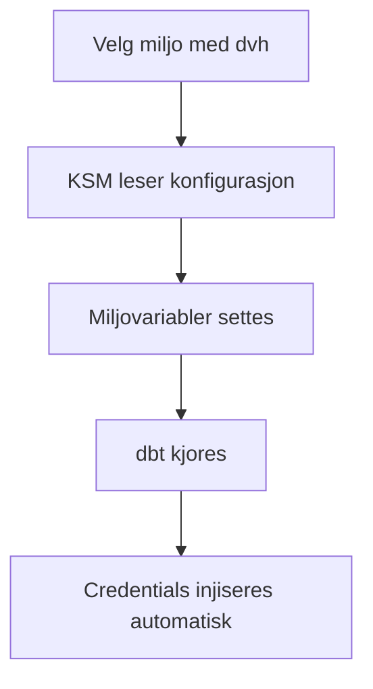
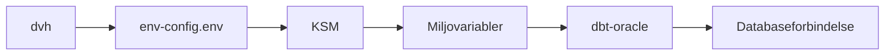

# Håndtering av hemmeligheter i Knast

Denne siden samler det viktigste om hemmeligheter og Oracle-credentials for dbt i Knast.

Målet er at du skal forstå nok til å bruke oppsettet trygt og kunne feilsøke når `dbt` ikke får riktig tilgang.

## Kortversjonen



Du skal normalt ikke håndtere Oracle-passord manuelt når dbt kjører i Knast.

## Hva KSM gjør

Knast Secret Manager, forkortet KSM, injiserer Oracle-credentials automatisk når `dbt` kjører. Brukeren trenger derfor normalt ikke å lime inn eller lagre passord manuelt i prosjektet.

KSM brukes for å:

- sette opp riktig miljø for valgt DVH-instans
- hente og eksponere nødvendige miljøvariabler
- sørge for at `dbt-oracle` får credentials på riktig tidspunkt

## Hvordan flyten ser ut



## Velg miljø

Det viktigste første steget er å velge DVH-miljø:

```bash
dvh
```

Når du kjører denne kommandoen, velger du:

- Python-miljø
- DVH-miljø

Valget lagres i `~/KSM/env-config.env`.

## Hva som lagres i miljøkonfigurasjonen

Filen `~/KSM/env-config.env` brukes av KSM for å vite hvilket miljø og hvilket oppsett som skal brukes.

Eksempler på variabler som kan ligge der:

```dotenv
DVH_ENVIRONMENT=DVH_P
SCHEMA=
DBT_DB_HOST=dmv01-scan.adeo.no
DBT_DB_PORT=1531
DBT_ENV_SECRET_USER=a123456
DBT_ENV_SERVICE=cccdwh01
VENV_PATH=/opt/KSM/.dbtenv
```

Disse skrives normalt automatisk av `dvh`.

## Hva du må ha i profiles.yml

I `profiles.yml` må dbt-prosjektet bruke miljøvariablene som KSM setter.

Eksempel:

```yaml
knast:
  host: "{{ env_var('DBT_DB_HOST') }}"
  password: placeholder
  port: "{{ env_var('DBT_DB_PORT') }}"
  protocol: tcp
  schema: <schema_name>
  service: "{{ env_var('DBT_ENV_SERVICE') }}"
  database: "{{ env_var('DBT_DB_NAME') }}"
  threads: 1
  type: oracle
  user: "{{ env_var('DBT_ENV_SECRET_USER') }}"
```

Det viktigste her er at:

- host, port, service og user hentes fra miljøvariabler
- `schema` må spesifiseres for prosjektet ditt
- `password` står som placeholder fordi credential-injeksjonen skjer utenfor selve filen

## Kjør dbt når miljøet er valgt

Når `dvh` er kjørt og riktig miljø er aktivt, kan du kjøre:

```bash
dbt debug
dbt run
dbt test
```

Da skal credentials hentes og injiseres automatisk.

## Eget Python-miljø

Hvis du bruker et eget virtuelt miljø, må KSM installeres i dette miljøet én gang:

```bash
dvh ksm install
```

Etter installasjon må Knast restartes dersom du forventer at editorutvidelser eller dbt-verktøy skal plukke opp det nye miljøet.

## Hvordan autoaktivering fungerer

Når Python starter i valgt miljø, lastes `.pth`-filer automatisk. Dette brukes til å aktivere KSM og credential-oppsettet før dbt trenger det.

Forenklet flyt:

```text
.pth filer
  -> ksm.auto
  -> leser ~/KSM/env-config.env
  -> setter miljøvariabler
  -> kobler på Oracle credential hook
  -> dbt får tilgang ved kjøring
```

Du trenger normalt ikke å forstå detaljene for å bruke løsningen, men dette er nyttig å vite ved feilsøking.

## Bytte miljø

Hvis du vil bytte DVH-miljø, kjør bare:

```bash
dvh
```

Velg nytt miljø i menyen. Neste dbt-kjøring bruker det oppdaterte oppsettet.

## Feilsøking

Hvis noe ikke fungerer, sjekk disse tingene først:

- er riktig miljø valgt med `dvh`
- er riktig Python-miljø aktivt
- bruker `profiles.yml` miljøvariablene riktig
- finnes `~/KSM/env-config.env` og ser den riktig ut

Nyttige kommandoer:

```bash
which python
echo $DVH_ENVIRONMENT
tail -f ~/KSM/logs/usage.log
```

Typiske feilbilder:

- `dbt` finner ikke database: feil miljø eller feil vertstilkobling
- credentials mangler: miljøet er ikke riktig satt opp
- `.pth`-fil ikke aktiv: feil Python-miljø er i bruk
- TNS-feil: nødvendig miljøinformasjon mangler eller er feil

## Viktig sikkerhetsprinsipp

Ikke bygg en alternativ lokal løsning for hemmeligheter hvis standardflyten i Knast fungerer. Det anbefalte løpet er:

- velg miljø med `dvh`
- bruk KSM og miljøvariabler
- la dbt hente credentials via oppsatt integrasjon

Da får du minst mulig manuelt hemmelighetsarbeid og minst mulig risiko for feil bruk.

## Relatert

- [Komme i gang med dbt i DVH](../DVH/komme-i-gang.md)
- [Opprett nytt dbt-prosjekt](../DVH/opprett-prosjekt.md)
- [Utvikling av dbt-prosjekter i Knast](utvikling-av-dbt-prosjekter.md)