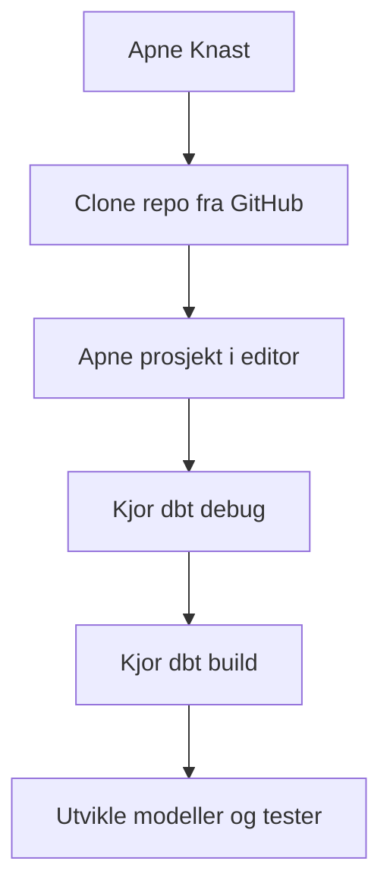
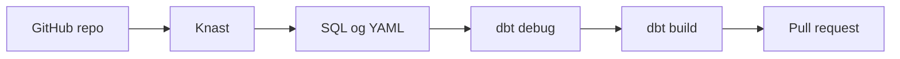

# Utvikling av dbt-prosjekter i Knast

Denne siden forklarer hvordan du faktisk jobber med dbt-prosjekter i Knast.

Hvis du bare vil komme i gang, holder det å lese de to første seksjonene. Resten av siden er mer utfyllende bakgrunn og praktiske detaljer.

## TL;DR

- åpne repoet ditt i Knast
- kjør `dbt debug`
- kjør `dbt build`
- begynn å endre SQL, YAML og tester
- bruk GitHub og pull requests som vanlig utviklingsflyt

Hvis dette fungerer, trenger du ikke lese resten av siden før du står fast.

## Gjør dette først

1. Clone eller åpne repoet ditt i Knast
2. Åpne prosjektet i editoren
3. Kjør:

```shell
dbt debug
dbt build
```

4. Hvis dette går grønt, kan du begynne å utvikle modeller og tester

Hvis `dbt debug` eller `dbt build` feiler, les først [Håndtering av hemmeligheter i Knast](handtering-av-hemmeligheter.md) og deretter resten av denne siden.

## Kortversjonen



## Når trenger du resten av denne siden?

Les videre hvis:

- GitHub ikke fungerer som forventet i Knast
- `dbt deps` eller `dbt build` feiler
- du er usikker på hvordan utviklingsflyten bør se ut
- du vil vite hvilke verktøy og regler som faktisk er relevante

## Hva Knast er i denne sammenhengen

Knast er standard utviklingsmiljø for dbt i DVH. Du jobber i nettleserbasert miljø med editor, terminal og nødvendige verktøy tilgjengelig.

For dbt-utvikling betyr dette normalt at du allerede har:

- Git
- editor og terminal
- dbt med Oracle-adapter
- Oracle-klient og tilhørende biblioteker
- tilgang til relevante databaser og verktøy

Du skal normalt ikke måtte bruke tid på lokal installasjon før du kan komme i gang.

Det viktigste er at Knast skal være arbeidsflaten din, ikke et prosjekt i seg selv.

## Typisk utviklingsflyt



I praksis ser dette ofte slik ut:

1. Opprett eller clone repoet ditt i Knast
2. Åpne prosjektet i editoren
3. Kjør `dbt debug`
4. Kjør `dbt build`
5. Endre SQL, YAML eller tester
6. Kjør på nytt
7. Opprett pull request

## GitHub i Knast

Git og `gh` er tilgjengelig i Knast, og det anbefales å bruke `gh` mot GitHub.

Autentiser mot GitHub:

```shell
gh auth login
```

Sett navn og e-post for git hvis dette ikke allerede er gjort:

```shell
git config --global user.email "your_name@email.com"
git config --global user.name "your_full_name"
```

Etter dette kan du jobbe via:

- `git` i terminal
- `gh` i terminal
- innebygd Source Control i VS Code / code-oss

## Første kommandoer i et nytt prosjekt

Kjør disse først:

```shell
dbt debug
dbt build
```

Du kan også kjøre `dbt run` hvis du bare vil verifisere at modeller bygges, men `dbt build` er ofte et bedre startpunkt fordi det også inkluderer tester.

For de fleste er dette hele startløypa: åpne repo, kjør `dbt debug`, kjør `dbt build`, begynn å endre modeller.

## Hva du bør forvente av miljøet

Du er godt i gang når du kan:

- åpne repoet i Knast
- endre SQL eller YAML
- kjøre `dbt debug`
- kjøre `dbt build`
- få en konkret dbt-feil eller et grønt resultat

Hvis du må bruke mye tid på maskinoppsett eller installasjon, er det som regel oppstartsløpet og ikke dbt-prosjektet som er problemet.

Det er en viktig tommelfingerregel: hvis utviklingsmiljøet krever mye manuelt arbeid før første dbt-kjøring, er noe feil.

## dbt-avhengigheter

Hvis prosjektet bruker pakker via `packages.yml`, må du kunne kjøre:

```shell
dbt deps
```

For dette kan det være nødvendig å åpne relevante GitHub- og dbt Hub-URL-er under Internettåpninger i Knast. Dette gjelder særlig hvis prosjektet bruker pakker som `dbt_utils`.

Hvis `dbt deps` ikke fungerer i Knast, sjekk først om disse URL-ene er åpnet:

- `codeload.github.com/dbt-labs/dbt-utils/tar.gz/*`
- `hub.getdbt.com/api/v1/*`
- `github.com/dbt-labs/dbt-utils.git`

Dette er mest relevant når et prosjekt faktisk bruker pakker. Hvis du ikke har `packages.yml`, trenger du ikke bruke tid på dette.

Eksempel på `packages.yml`:

```yaml
packages:
  - package: dbt-labs/dbt_utils
    version: 1.3.3
```

## Utvikling i editoren

Den vanlige arbeidsflaten er editoren i Knast sammen med terminal.

Typisk jobber du mest i:

- SQL-modeller
- YAML-filer for modeller, kilder og tester
- `dbt_project.yml`

Det viktigste er å få en enkel og repeterbar flyt: endre kode, kjør dbt, les resultatet, iterer.

## VS Code-utvidelser og verktøy

`Power User for dbt` er allerede installert på relevante dbt-images og fungerer fint sammen med Knast.

SQL Developer-utvidelsen finnes også, men kan kollidere med dbt Power User på hurtigtaster. Hvis du bruker SQL Developer-utvidelsen aktivt, bør du endre hurtigtastene slik at de ikke overlapper med dbt-flyten.

Dette er nyttig, men ikke nødvendig for å komme i gang. Prioriter først at `dbt debug` og `dbt build` fungerer.

Det betyr i praksis at editorverktøy er sekundære. Først må selve dbt-flyten være stabil.

## Regler og anbefalinger

For dbt-utvikling i DVH gjelder i praksis disse hovedreglene:

- bruk nettleserbasert Knast mot DVH
- unngå å lagre data lokalt i Knast over tid
- rydd i filer som inneholder sensitiv informasjon
- åpne eksterne URL-er bare ved tjenstlig behov

Hvis du trenger ekstra Python-pakker i egne miljøer, bruk den anbefalte Knast-måten for dette. Ikke gjør tilfeldige lokale oppsett til en del av standard dbt-flyt.

Kort sagt: hold utviklingsløpet enkelt og repeterbart.

## Når du er klar til å utvikle

Du er klar for vanlig dbt-utvikling når dette stemmer:

- GitHub fungerer i Knast
- prosjektet åpner fint i editoren
- `dbt debug` går gjennom
- `dbt build` går gjennom eller feiler på en forståelig prosjektfeil

Da kan du gå videre med modeller, tester og dokumentasjon.

## Relatert

- [Komme i gang med dbt i DVH](../DVH/komme-i-gang.md)
- [Opprett nytt dbt-prosjekt](../DVH/opprett-prosjekt.md)
- [Håndtering av hemmeligheter i Knast](handtering-av-hemmeligheter.md)