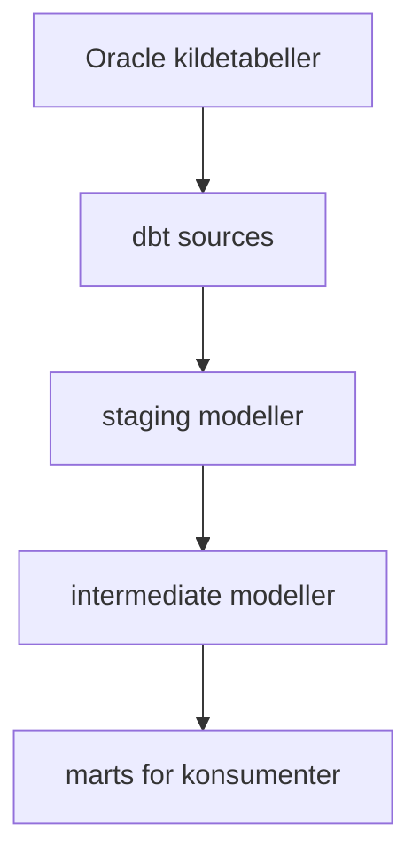
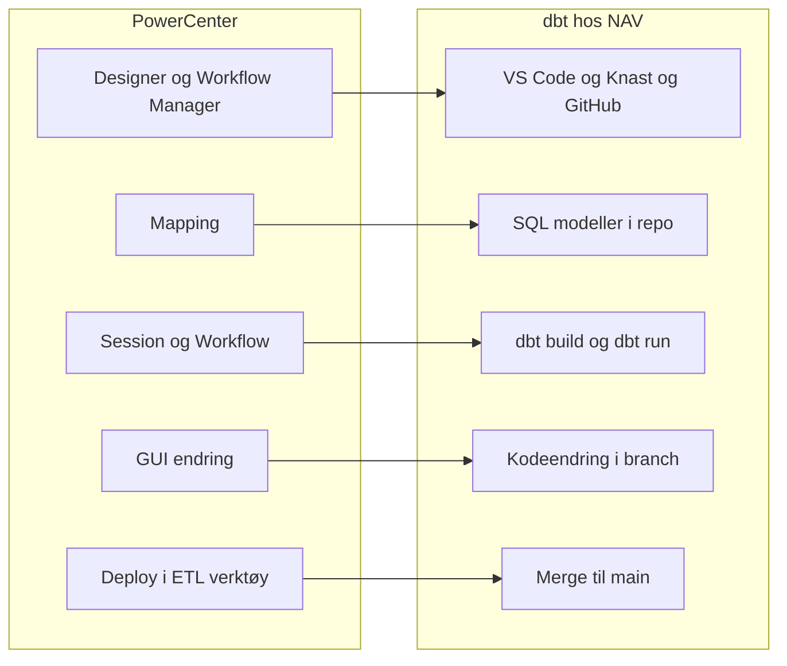
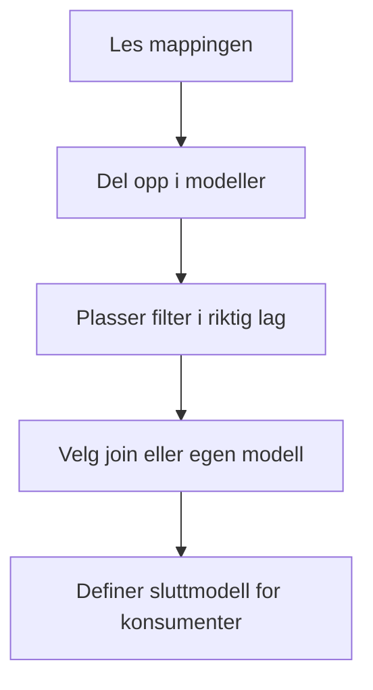
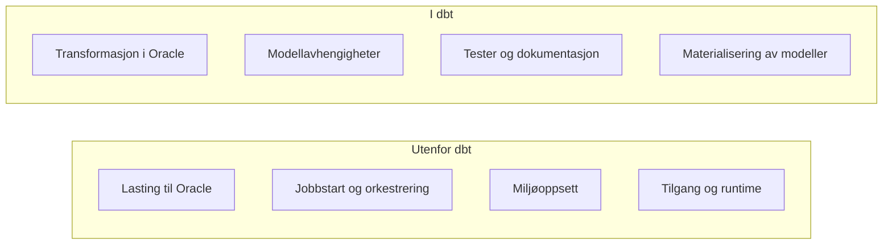
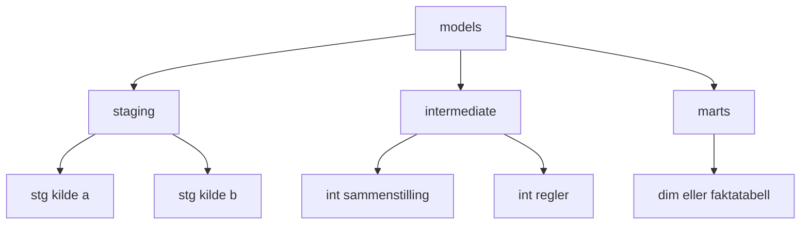
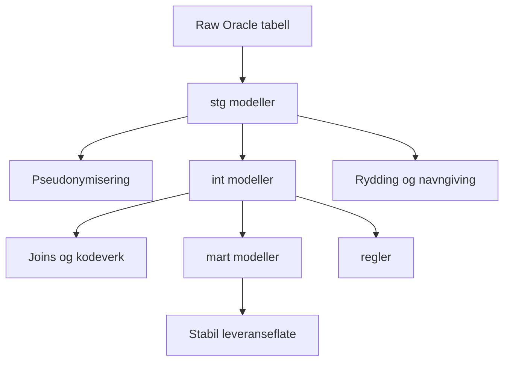
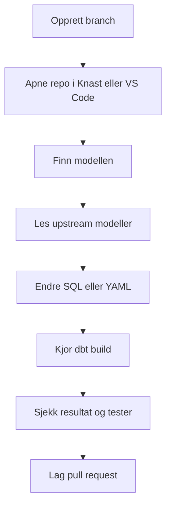
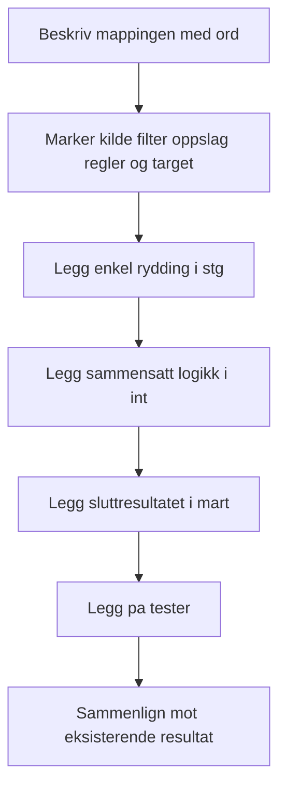

# Fra PowerCenter til dbt

Denne siden er for deg som kan PowerCenter godt, men som skal begynne å jobbe med dbt. Målet er ikke å lære alt på en gang, men å gi deg et praktisk mentalt kart: hva som er likt, hva som er annerledes, og hvordan du kommer i gang uten å måtte forstå hele dbt-økosystemet først.

Hos NAV betyr dette som regel at du går fra et GUI-basert ETL-verktøy til SQL-utvikling i GitHub, med kjøring mot Oracle via `dbt-core` og `dbt-oracle`, ofte fra Knast.

## Slik ser det typisk ut hos NAV



Det viktigste å se her er at dbt hos NAV normalt ikke henter data fra kildesystemer selv. Data er allerede lastet til Oracle. dbt brukes til å strukturere og kjøre transformasjonene videre.

## Kortversjonen

Hvis du kommer fra PowerCenter, er den viktigste forskjellen dette:

- I PowerCenter bygger du flyt i et grafisk ETL-verktøy.
- I dbt bygger du transformasjoner som SQL-modeller i kode.
- I PowerCenter flyttes og transformeres data ofte i samme verktøy.
- I dbt antar vi at data allerede finnes i databasen, og at dbt kun tar seg av transformasjonen.

Du kan tenke på dbt som en kombinasjon av:

- mapping-logikk skrevet i SQL
- avhengighetsstyring mellom mappingene
- testing og dokumentasjon tett på koden
- Git-basert utviklingsflyt

## PowerCenter-verden vs NAV sin dbt-verden



For en PowerCenter-utvikler er dette ofte den største endringen: du jobber mindre i verktøyets metadata og mer direkte i kodebasen.

## Den viktigste mentale overgangen

PowerCenter inviterer til å tenke i steg og objekter i et GUI. dbt inviterer til å tenke i modeller og avhengigheter.

I praksis betyr det:

- Du tegner ikke flyten. Du skriver den.
- Du jobber ikke rad for rad. Du tenker sett-basert SQL.
- Du legger ikke logikk i mange små transformasjonsbokser. Du deler heller opp logikken i flere modeller.
- Du bruker Git, pull requests og kodegjennomgang som en naturlig del av utviklingen.

Hvis du prøver å gjenskape en PowerCenter-mapping 1:1 i dbt, blir resultatet ofte unødvendig komplisert. Den riktige tilnærmingen er vanligvis å oversette intensjonen, ikke verktøystrukturen.

## Tenk slik når du oversetter en PowerCenter-jobb



## PowerCenter-begreper oversatt til dbt

| PowerCenter | Hva det ofte betyr | Typisk i dbt |
|---|---|---|
| Source | Inndata fra kildesystem | `source()` |
| Target | Resultattabell | modell i `models/` |
| Mapping | Transformasjonsflyt | én eller flere dbt-modeller |
| Workflow / Session | Kjøring og orkestrering | `dbt run` / `dbt build`, ofte styrt utenfor dbt |
| Source Qualifier | Uttrekk og enkel filtrering | staging-modell |
| Expression | Kolonneuttrykk og derivert logikk | SQL i `select` |
| Filter | Filtrering av rader | `where` |
| Joiner | Sammenkobling av datasett | `join` i SQL |
| Lookup | Oppslag mot annen tabell | `join`, eventuelt egen modell |
| Aggregator | Gruppering og summering | `group by` |
| Router | Ulike logiske grener | flere modeller eller `case when` |
| Reusable transformation | Gjenbrukbar logikk | egen modell, makro eller test |

Dette er ikke en perfekt 1:1-oversettelse, men det er et godt startpunkt.

## NAV-spesifikt: hva gjør dbt, og hva gjør det ikke?

Hos NAV er dbt typisk ansvarlig for SQL-transformasjonene i databasen. dbt er vanligvis ikke stedet der du:

- henter filer fra eksterne kilder
- styrer avansert batchorkestrering på tvers av mange systemer
- gjør generell shell- eller Python-automatisering

Tenk derfor slik:



Dette gjør også at mange PowerCenter-løsninger må deles opp mentalt i to: det som er ren transformasjon, og det som egentlig er orkestrering eller innlasting.

## Hvordan en typisk løsning ser ut i dbt

I dbt deler vi ofte logikken inn i lag:



### 1. Staging

Her rydder du opp i rådata:

- gir kolonner bedre navn
- normaliserer datatyper
- filtrerer bort åpenbart irrelevante rader
- gjør kildelogikk lettere å lese videre nedstrøms

Dette tilsvarer ofte det PowerCenter-utviklere ville lagt i Source Qualifier, Expression og enkel Filter-logikk.

### 2. Intermediate

Her legger du mer sammensatt forretningslogikk:

- joins
- avledede felt
- oppslag
- delberegninger

Dette tilsvarer ofte midten av en større mapping.

### 3. Mart

Her lager du tabellene som faktisk skal brukes av konsumenter, rapporter eller videre behandling.

Dette tilsvarer ofte target-strukturen du ønsker å levere stabilt over tid.

Hos NAV vil dette ofte være laget der konsumenter, rapporter eller andre komponenter forventer stabil struktur og stabile kolonnenavn.

## Et konkret eksempel

La oss si at du i PowerCenter har en mapping som:

1. Leser kunder fra en kildetabell
2. Filtrerer bort inaktive kunder
3. Slår opp landnavn fra en kodeverkstabell
4. Regner ut kundetype
5. Skriver resultatet til en dimensjonstabell

I dbt vil dette ofte bli delt opp slik:

### `stg_customers.sql`

```sql
select
    customer_id,
    country_code,
    status,
    created_date
from {{ source('crm', 'customers') }}
where status = 'ACTIVE'
```

### `int_customers_enriched.sql`

```sql
select
    c.customer_id,
    c.created_date,
    l.country_name,
    case
        when c.created_date >= add_months(sysdate, -12) then 'NEW'
        else 'EXISTING'
    end as customer_type
from {{ ref('stg_customers') }} c
left join {{ ref('stg_country_codes') }} l
    on c.country_code = l.country_code
```

### `dim_customers.sql`

```sql
select *
from {{ ref('int_customers_enriched') }}
```

Poenget er ikke at alle løsninger må deles opp i tre filer. Poenget er at dbt gjør det naturlig å dele logikk i lesbare steg, i stedet for å samle alt i én stor mapping.

## Et NAV-nært eksempel

Tenk deg en gammel PowerCenter-flyt som gjør dette:

1. Leser rådata fra Oracle-tabeller i datavarehuset
2. Filtrerer til gyldige perioder
3. Slår opp kodeverk og statusbeskrivelser
4. Pseudonymiserer nøkkelverdier tidlig i løpet
5. Lager en target-tabell som andre skal lese fra

I dbt vil du ofte tenke slik:



Dette passer godt med anbefalingene ellers i denne dokumentasjonen om å gjøre sensitiv håndtering tidlig og å holde konsumentnære modeller stabile.

## Det du slipper å tenke på med en gang

Mange som kommer fra PowerCenter tror de må lære alt om Jinja, makroer, pakker, snapshots og avanserte materialiseringer med én gang. Det stemmer ikke.

For å komme i gang holder det ofte å kunne:

- skrive SQL
- forstå `source()` og `ref()`
- vite forskjellen på view, table og incremental
- kjøre `dbt run` og `dbt test`

Resten kan komme etter hvert.

## Dette bør du lære først i NAV-kontekst

Hvis du er ny i dbt hos NAV, er dette vanligvis nok for å bli produktiv:

1. Hvordan repoet er strukturert
2. Hvordan du kjører dbt fra Knast eller lokalt oppsett
3. Hvordan `source()` og `ref()` brukes
4. Hvordan du leser en modellkjede fra staging til mart
5. Hvordan du legger på enkle tester

Du trenger vanligvis ikke starte med makroer, pakker eller avansert Jinja.

## De viktigste dbt-begrepene å lære først

### `source()`

Brukes når du leser fra en definert kildetabell.

```sql
select *
from {{ source('hr', 'employees') }}
```

### `ref()`

Brukes når du refererer til en annen dbt-modell. dbt bruker dette til å forstå avhengigheter og kjørerekkefølge.

```sql
select *
from {{ ref('stg_employees') }}
```

### Tester

I PowerCenter ligger kontroll og kvalitet ofte utenfor selve mappingen. I dbt er testing en del av modellen.

Eksempel:

```yaml
models:
  - name: dim_customers
    columns:
      - name: customer_id
        data_tests:
          - not_null
          - unique
```

Dette er en av de største styrkene i dbt: logikk, tester og dokumentasjon ligger samlet.

## Slik ser en vanlig arbeidsdag ut



For mange PowerCenter-utviklere er dette uvant i starten. Etter kort tid oppleves det ofte som enklere, fordi logikken blir søkbar, versjonert og lettere å lese i sammenheng.

## Slik jobber du i praksis

En enkel arbeidsflyt i dbt ser ofte slik ut:

1. Definer kilden i YAML
2. Lag en staging-modell med enkel opprydding
3. Lag én eller flere modeller med forretningslogikk
4. Legg på tester
5. Kjør `dbt build --select modellnavn`
6. Se på resultatet og iterer

Det er bedre å lage små, lesbare modeller enn å prøve å få alt riktig i én stor SQL-fil.

## Fra PowerCenter-mapping til dbt-modeller: en enkel oppskrift



Dette er ofte en bedre start enn å åpne PowerCenter og prøve å oversette komponent for komponent.

## Første oppgave for en PowerCenter-utvikler

Hvis du skal lære dbt raskt, ikke start med den mest komplekse mappingen. Start med en enkel og representativ flyt.

Velg en mapping som:

- har én tydelig kilde
- har moderat mengde logikk
- ikke er ekstremt avhengig av sideeffekter eller spesialhåndtering
- har et resultat du kjenner godt fra før

Gjør så dette:

1. Beskriv mappingen med vanlig språk før du skriver kode
2. Del logikken i staging, intermediate og mart
3. Skriv SQL-modellene
4. Sammenlign resultatet mot dagens løsning
5. Legg på grunnleggende tester

Det er ofte den raskeste veien til å forstå hvordan dbt tenker.

## Typisk repo-struktur du vil møte

```text
repo/
├── models/
│   ├── staging/
│   ├── intermediate/
│   └── marts/
├── macros/
├── tests/
├── dbt_project.yml
└── packages.yml
```

I praksis vil du ofte jobbe mest i `models/` og litt i YAML-filene som beskriver modeller, kilder og tester.

## Vanlige feil når man kommer fra PowerCenter

### 1. Å prøve å bygge én gigantisk modell

I dbt er det ofte bedre med flere små modeller enn én stor og tettpakket SQL.

### 2. Å tenke for mye prosess og for lite modell

dbt handler først og fremst om transformasjoner og avhengigheter, ikke om kompleks orkestrering.

### 3. Å prøve å gjenskape GUI-logikken direkte

En Router trenger ikke bli én Router i dbt. Kanskje den blir to modeller. Kanskje den blir en `case when`. Kanskje den burde bort helt.

### 4. Å undervurdere Git

I dbt er versjonskontroll ikke et tillegg. Det er en del av arbeidsmåten.

### 5. Å legge for mye inn i incremental for tidlig

Mange problemer løses enklere med en vanlig view- eller table-modell først. Få logikken riktig før du optimaliserer.

### 6. Å glemme at Oracle allerede er arbeidsflaten

I dbt hos NAV skjer transformasjonen typisk i Oracle. Tenk derfor på datamodellering, SQL-lesbarhet og kjøreplaner, ikke bare på ETL-flyt.

## Når dbt ikke er en direkte erstatning

dbt er ikke et fullverdig ETL-verktøy i samme forstand som PowerCenter.

dbt passer best når:

- data allerede er tilgjengelig i databasen
- transformasjonene kan uttrykkes godt i SQL
- du ønsker testbar, lesbar og versjonert transformasjonslogikk

dbt er mindre egnet når problemet hovedsakelig handler om:

- kompleks innlasting fra mange eksterne systemer
- tung filhåndtering
- prosesslogikk utenfor databasen
- avansert orkestrering som hovedoppgave

## Hvordan du kjenner igjen en god første migreringskandidat

```text
Bra første kandidat                         Dårlig første kandidat
-------------------                         --------------------
1-3 kilder                                 mange eksterne avhengigheter
tydelig target                             tung shell-/filbehandling
mest SQL-logikk                            mye runtime-styring
enkel sammenligning mot dagens resultat    mange sideeffekter
```

## Anbefalt læringsrekkefølge

For en PowerCenter-utvikler vil denne rekkefølgen vanligvis fungere godt:

1. Lær `source()` og `ref()`
2. Lær hvordan modeller bygges i flere lag
3. Lær grunnleggende tester
4. Lær materialiseringer
5. Lær makroer og mer avansert gjenbruk ved behov

## Oppsummering i én figur

```text
PowerCenter-kompetanse du har
  |
  v
forståelse for datakilder, regler, target og kontroll
  |
  v
oversettes i dbt til
  |
  +--> staging-modeller
  +--> intermediate-modeller
  +--> mart-modeller
  +--> tester
  +--> Git-basert utviklingsflyt
```

## Veien videre

Når du har lest denne siden, er det naturlig å gå videre til:

- [Hva er dbt](index.md)
- [Hvorfor dbt](hvorfor-dbt.md)
- [Materialiseringsstrategier](arkitektur/materialisering.md)
- [Hva er nytt i dbt](hva-er-nytt.md)