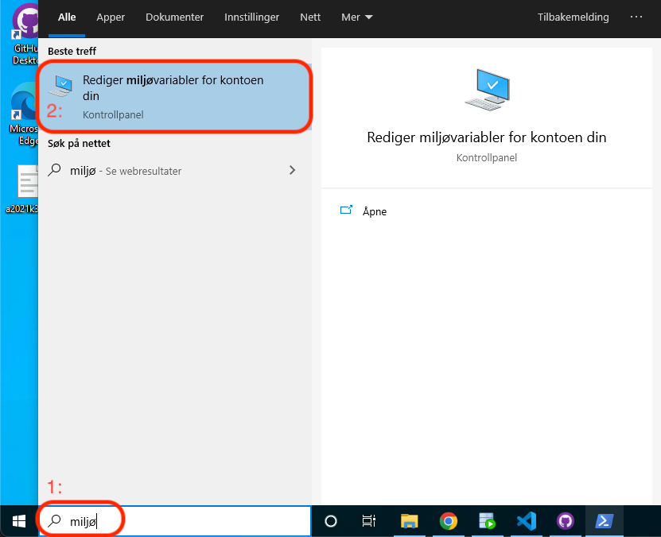
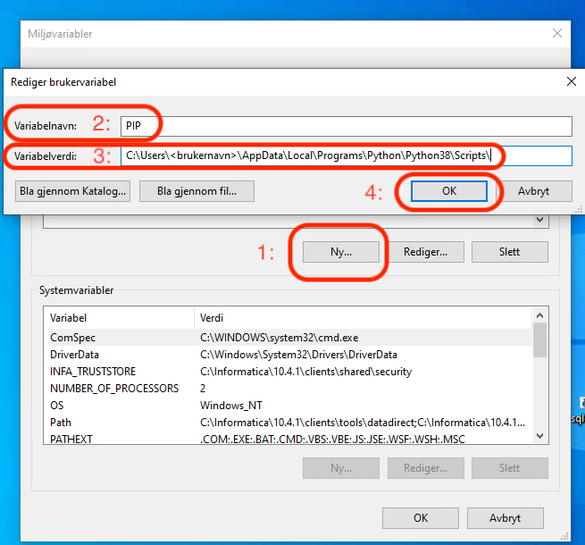
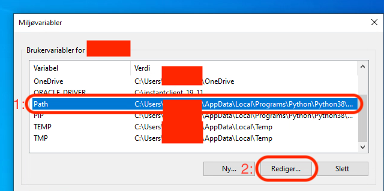
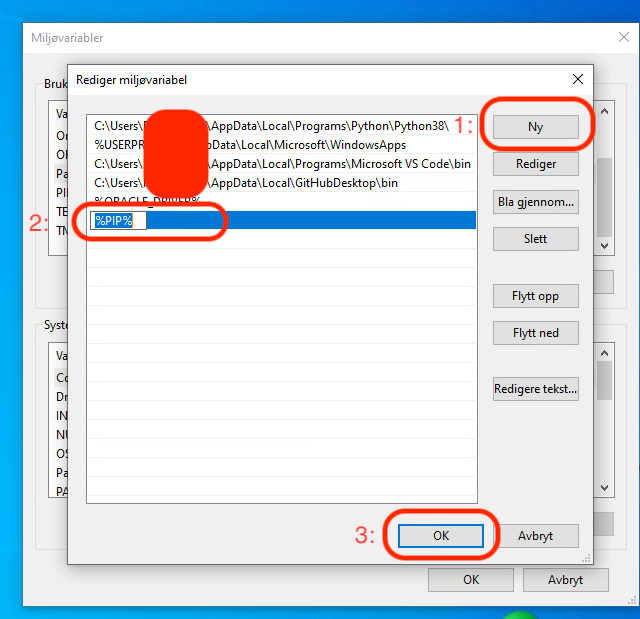
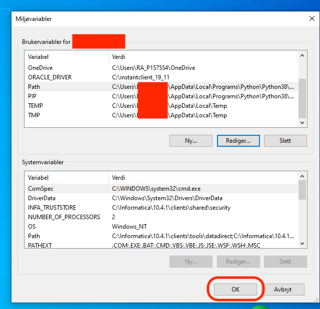

# Legge til miljøvariabler

1. Søk etter `miljøvariabler`
2. Klikk på: `Rediger miljøbariabler for kontoen din`

1. Trykk på `Ny...`
2. Gi variabelen et navn i `Variabelnavn`.
3. Skriv inn path til programmet i `Variabelverdi`
4. Trykk `OK`

1. Marker `Path` variabelen
2. Trykk `Rediger...`

1. Trykk `Ny`
2. Skriv inn navnet på variabelen du opprettet med syntaksen `%<variabelnavn>%` eks: `%PIP%`
3. Trykk `OK`

1. Trykk `OK`

!!! note

    Husk at du må lukke `cmd` (ledetekst) og åpne på nytt for at endringen skal tre i kraft.
